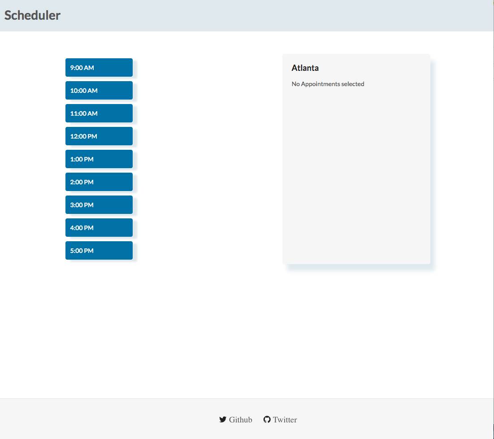
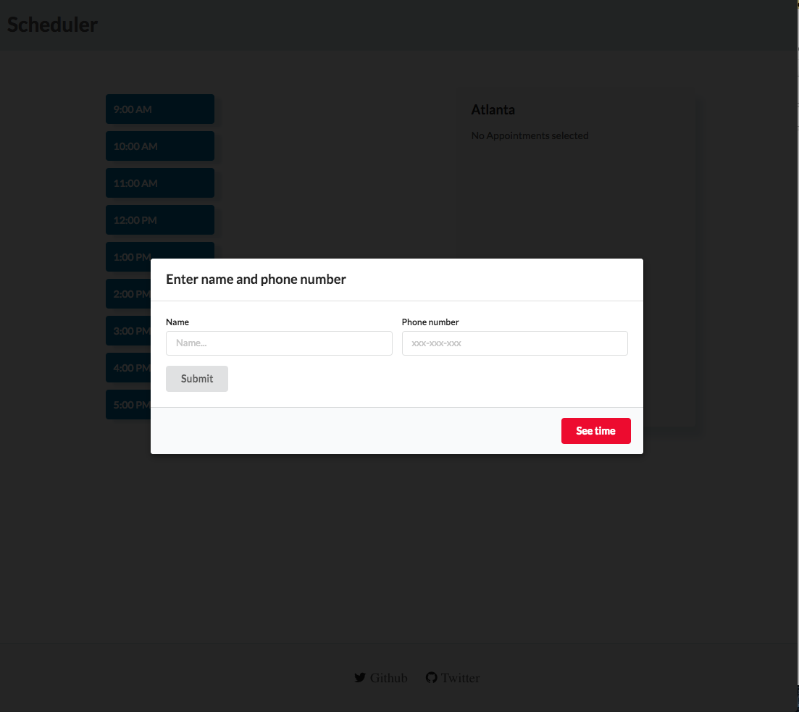
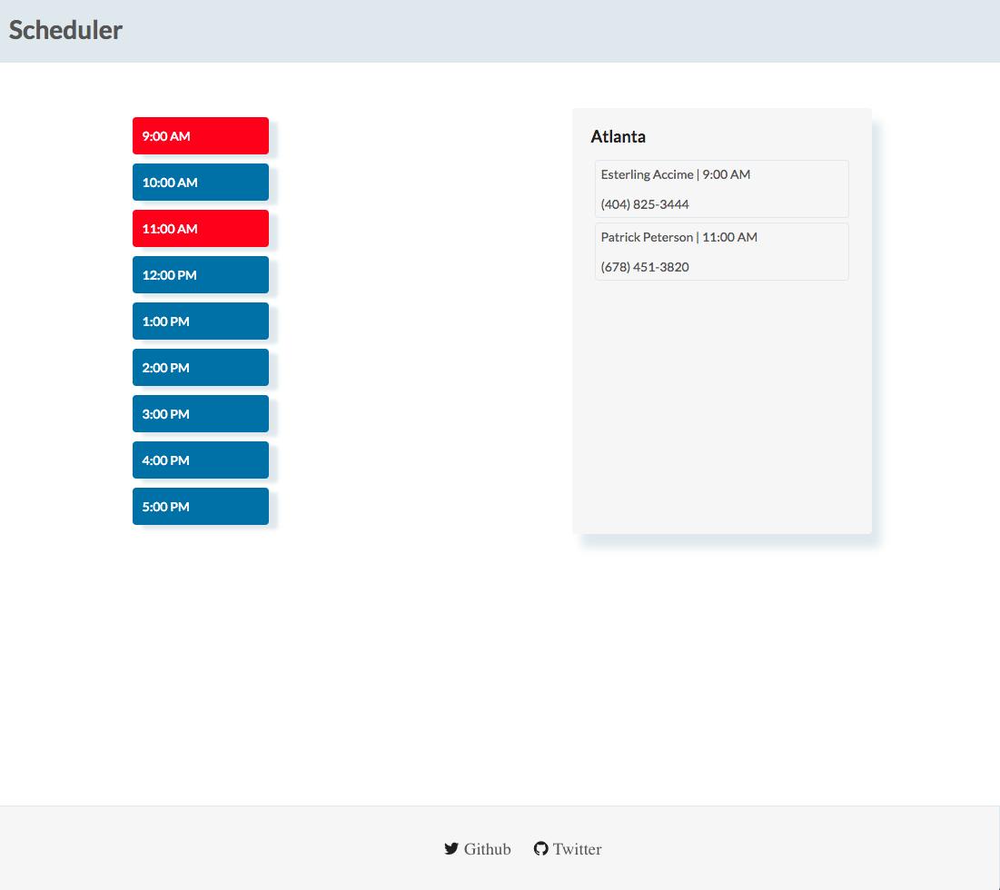
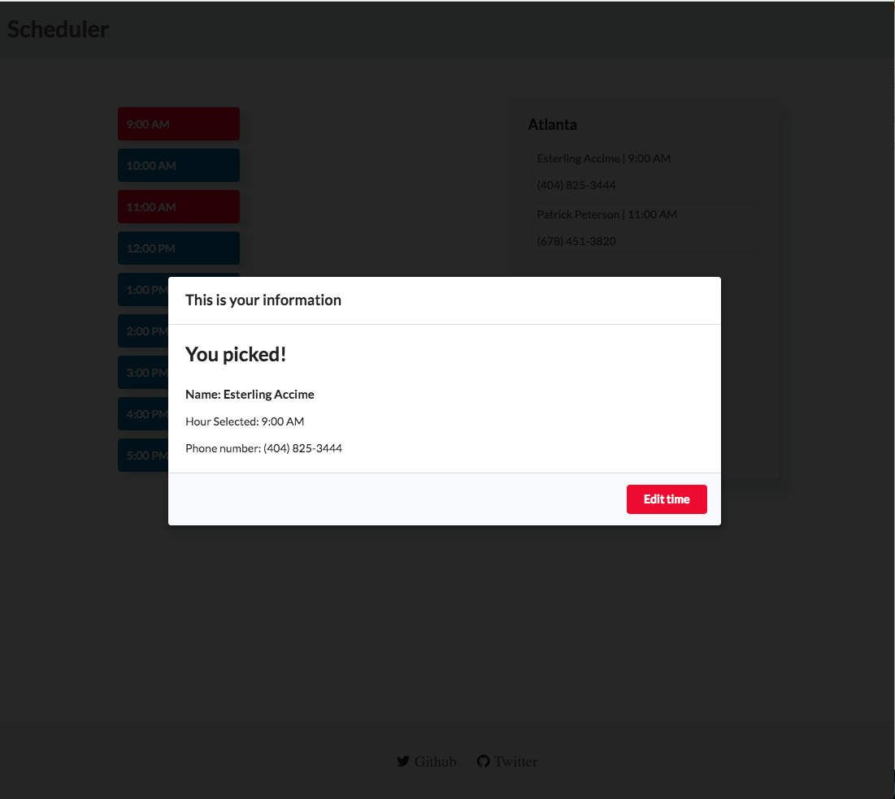
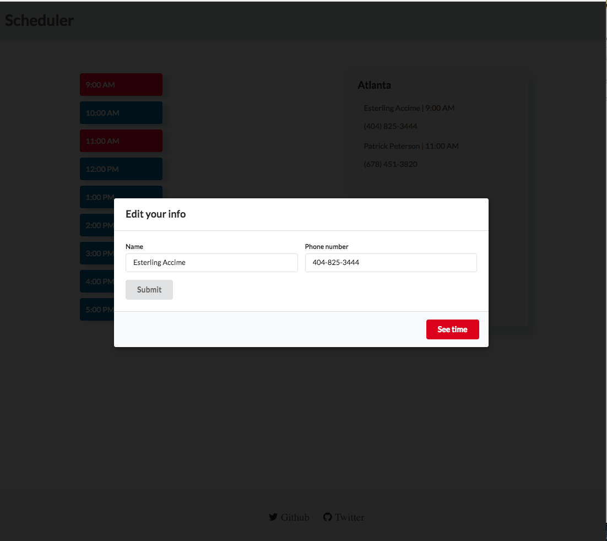
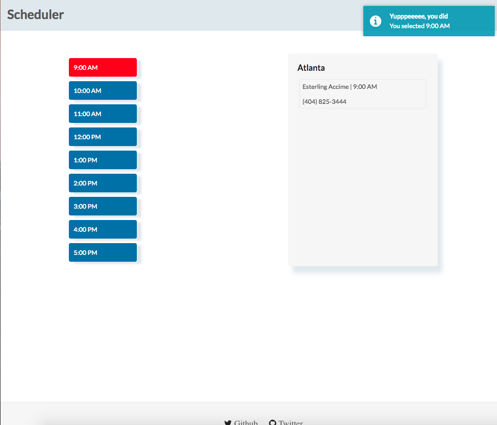
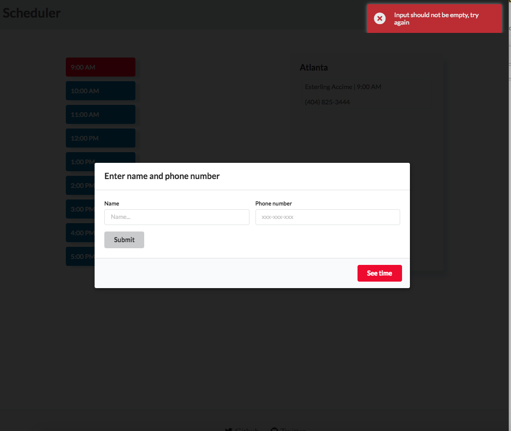

# Scheduler

Follow these steps below in order to run the app locally

### Step 1:

``` git clone https://github.com/accimeesterlin/Scheduler.git ```

### Step 2:

``` npm i ```

### Step 3:

``` npm start ```


If everything goes smoothly, you should see something similar to what you see below


#### Home Page



#### Enter your information



#### Display appointments



#### Show their info on next click on red



#### Edit information



#### Confirmation notifications


#### Error notifications



### Run test
``` npm test ```